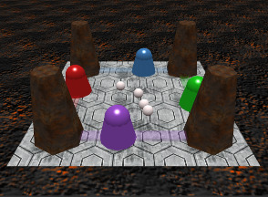

Dash Bash!
==========



Dash Bash! is a simple browser-based multiplayer 4-way ping pong game.

Dash Bash! was built with Node.js and PhysicsJS on the backend and BabylonJS on the frontend.

Running with Docker
-------------------

A Dockerfile which will set up and run both subprojects is provided with this repository.

To start the image, simply run:

```
docker build -t dashbash .;
docker run --rm -p 8080:8080 -p 3000:3000 dashbash;
```

Open http://127.0.0.1:3000 in your browser and the game should run!

License
-------

The whole project is licensed under the AGPLv3. Details are available in the file [LICENSE](LICENSE).

